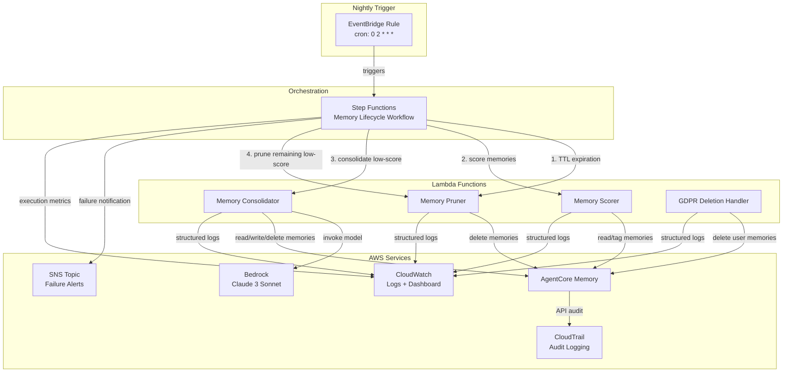

# The Forgetting Problem: Designing Memory Lifecycle Policies for Long-Running AgentCore Agents

*How to keep your AI agents sharp by teaching them when — and how — to forget.*

---

## Introduction

Every conversation your AI agent has generates memories. User preferences, past interactions, resolved support tickets, learned workflows — they all accumulate in [Amazon Bedrock AgentCore](https://docs.aws.amazon.com/bedrock-agentcore/latest/devguide/what-is-bedrock-agentcore.html) Memory. At first, this is a superpower. Your agent recalls that a customer prefers Python over Java, remembers the deployment issue from last Tuesday, and knows which runbook to follow for a database failover.

But what happens after six months of production use?

We watched a customer support agent confidently reference a billing dispute that had been resolved four months earlier — treating it as an active issue and confusing the customer. The agent wasn't hallucinating. It was *remembering too much*. The resolved ticket was still sitting in memory, indistinguishable from current context. The agent's memory had become a liability.

This is the forgetting problem. Agents that remember everything eventually drown in irrelevant context. Outdated memories pollute the retrieval window, push token costs higher as context grows, and create compliance risks when stale personal data lingers past its useful life. Every blog post about agent memory focuses on storage and retrieval — but none address the equally critical question of *when and how to forget*.

In this post, we introduce memory lifecycle management for AI agents — the practice of systematically scoring, consolidating, and pruning agent memories over time (sometimes called memory hygiene). We borrow from database lifecycle patterns but adapt them for the unique challenges of LLM-consumed context. We walk through a production-ready architecture using [Amazon Bedrock AgentCore](https://docs.aws.amazon.com/bedrock-agentcore/latest/devguide/what-is-bedrock-agentcore.html) Memory, [AWS Step Functions](https://docs.aws.amazon.com/step-functions/latest/dg/welcome.html), and [Amazon Bedrock](https://docs.aws.amazon.com/bedrock/latest/userguide/what-is-bedrock.html) to periodically score, consolidate, and prune agent memories. By the end, you will have a deployable CDK stack that runs a nightly lifecycle workflow — and a framework for thinking about agent memory as a managed resource, not an append-only log.

## Who Should Use This

Not every agent needs aggressive memory lifecycle management. This solution is designed for agents that accumulate high volumes of interaction data over weeks or months — customer support agents, sales advisors, IT helpdesk bots, and similar high-throughput use cases. If your agent handles hundreds of conversations per day, memory bloat will become a problem.

For low-volume agents — personal assistants with a single user, or agents that rely on long-term historical context (e.g., healthcare or legal advisors) — you may want to start with TTL expiration and GDPR compliance only, and skip aggressive scoring and consolidation. All thresholds in this solution are configurable, so you can dial them to match your agent's needs.

## Prerequisites

Before deploying the solution, make sure you have the following:

- An [AWS account](https://aws.amazon.com/account/) with permissions to create Lambda functions, Step Functions state machines, EventBridge rules, SNS topics, CloudWatch dashboards, CloudTrail trails, and S3 buckets
- [AWS CDK v2](https://docs.aws.amazon.com/cdk/v2/guide/home.html) installed (`npm install -g aws-cdk`)
- [Node.js](https://nodejs.org/) 18+ and npm
- [Python 3.12](https://www.python.org/downloads/) with pip
- [Amazon Bedrock](https://docs.aws.amazon.com/bedrock/latest/userguide/what-is-bedrock.html) model access enabled for Claude 3 Sonnet (`anthropic.claude-3-sonnet-20240229-v1:0`) in your target region
- [Amazon Bedrock AgentCore](https://docs.aws.amazon.com/bedrock-agentcore/latest/devguide/what-is-bedrock-agentcore.html) with at least one agent configured with memory enabled
- AWS CLI configured with appropriate credentials

Clone the repository and install dependencies:

```bash
cd code
npm install
```

## A Taxonomy of Agent Memory

Before we can design lifecycle policies, we need a shared vocabulary for what agents actually remember. Not all memories are created equal, and different types demand different retention strategies. We categorize agent memory into three types, each mapping to capabilities in [Amazon Bedrock AgentCore](https://docs.aws.amazon.com/bedrock-agentcore/latest/devguide/what-is-bedrock-agentcore.html) Memory.

### Episodic Memory

Episodic memories capture *what happened* — the raw record of past conversations and interactions. "The user asked about S3 pricing on March 12th." "We troubleshot a Lambda cold start issue last week." These are timestamped, session-bound, and high-volume. They are the most likely to become stale and the first candidates for expiration.

In AgentCore Memory, episodic memories are stored as individual entries tied to specific agent-user sessions. They are valuable for short-term continuity ("As we discussed earlier...") but lose relevance quickly as conversations move on.

### Semantic Memory

Semantic memories are *distilled facts and preferences* — knowledge extracted from interactions but decoupled from any single conversation. "The user prefers us-east-1 for deployments." "Their team uses Terraform, not CloudFormation." These are durable, high-value, and compact.

Semantic memories are what make an agent feel like it truly knows the user. They should be retained longer than episodic memories and are prime candidates for consolidation — merging multiple episodic observations into a single, authoritative fact.

### Procedural Memory

Procedural memories encode *learned workflows and tool-use patterns*. "When the user asks about costs, query the Cost Explorer API first, then summarize." "For deployment issues, always check the CloudFormation stack events before suggesting fixes." These represent the agent's operational expertise.

Procedural memories are the rarest and most valuable type. They should have the longest retention and the highest bar for pruning. Losing a procedural memory means the agent forgets *how* to do something, not just *what* happened.

## Designing Memory Lifecycle Policies

With our taxonomy in place, we can design three complementary lifecycle policies. Each targets a different failure mode of unbounded memory.

### Policy 1: TTL-Based Expiration

The simplest policy: automatically delete memories older than a configured time-to-live (TTL). We default to 90 days, which works well as a starting point for episodic memories in customer-facing agents. This is a blunt instrument — it does not consider whether a memory is still useful — but it provides a hard ceiling on memory accumulation and is essential for compliance.

In production, we recommend differentiating TTL by memory type. Episodic memories (session transcripts, resolved tickets) might expire after 30–60 days. Semantic memories (user preferences, distilled facts) could last 6–12 months. Procedural memories (learned workflows) may never expire via TTL at all — they are too valuable and too rare. The implementation in this post uses a single configurable TTL as a baseline; extending it to per-type policies is a natural next step.

TTL expiration runs first in our workflow, before any scoring or consolidation. This ensures we never waste compute evaluating memories that should already be gone.

### Policy 2: Relevance Decay Scoring

Not all memories age at the same rate. A memory accessed yesterday is more relevant than one untouched for weeks, regardless of when it was created. We score each memory using a weighted decay formula that combines three signals:

```python
score = (W_RECENCY * exp(-DECAY_RATE * days_since_creation)
       + W_ACCESS  * exp(-DECAY_RATE * days_since_last_access)
       + W_FREQUENCY * min(access_count / MAX_ACCESS_BASELINE, 1.0))
```


With weights `W_RECENCY = 0.4`, `W_ACCESS = 0.4`, `W_FREQUENCY = 0.2`, and a `DECAY_RATE` of `0.05`, this formula produces a score between 0.0 and 1.0. Memories scoring below a configurable threshold (default: 0.3) become candidates for consolidation or pruning.

The formula balances three intuitions: recent memories matter (recency), recently *used* memories matter even more (access recency), and frequently accessed memories have proven their value (frequency). The exponential decay means a memory's score drops sharply in the first few weeks, then levels off — mirroring how human memory works.

Here is the scoring function from our Memory Scorer Lambda (`code/lambdas/memory_scorer/handler.py`):

```python
def compute_relevance_score(
    created_at: datetime,
    last_accessed_at: datetime,
    access_count: int,
    now: datetime,
) -> float:
    """Compute relevance score using the weighted decay formula.

    Returns a float in [0.0, 1.0].
    """
    days_since_creation = max((now - created_at).total_seconds() / 86400, 0.0)
    days_since_last_access = max((now - last_accessed_at).total_seconds() / 86400, 0.0)

    recency_factor = math.exp(-DECAY_RATE * days_since_creation)
    access_factor = math.exp(-DECAY_RATE * days_since_last_access)
    frequency_factor = min(access_count / MAX_ACCESS_BASELINE, 1.0)

    score = (W_RECENCY * recency_factor
           + W_ACCESS * access_factor
           + W_FREQUENCY * frequency_factor)
    return score
```

### Policy 3: LLM-Based Consolidation

Before we prune low-scoring memories, we give them one last chance. Consolidation uses [Amazon Bedrock](https://docs.aws.amazon.com/bedrock/latest/userguide/what-is-bedrock.html) to summarize and merge related memories into a single, compact semantic entry. Five episodic memories about a user's deployment preferences become one authoritative semantic memory: "User prefers blue/green deployments to us-east-1 using CDK with Python."

This is meta-cognition — an LLM reasoning about its own memories. The consolidation prompt instructs the model to preserve essential facts, remove redundancy, and output a confidence score:

```python
CONSOLIDATION_PROMPT_TEMPLATE = """You are a memory consolidation assistant.
Given the following agent memories, create a single concise summary that
preserves all essential facts, user preferences, and actionable knowledge.
Remove redundancy and outdated information.

Memories:
{memory_contents}

Output a JSON object with:
- "summary": the consolidated memory text
- "confidence": a float 0.0-1.0 indicating consolidation quality
- "key_facts": list of preserved key facts"""
```

The consolidated memory is stored back in AgentCore Memory with provenance tags — `consolidated: true`, a `confidence_score`, and a `source_memories` list linking back to the originals. After successful storage, the original memories are deleted. If Bedrock fails, we retain all originals unchanged. If some deletions fail after consolidation, we log the orphaned memory IDs for manual review.

A word of caution: consolidation is lossy by nature. An LLM summarizing five memories into one will inevitably drop some nuance. For example, "User prefers blue/green deployments but switched away from canary releases after a 2023 outage" might consolidate to simply "User prefers blue/green deployments" — losing the context about *why*. The `confidence_score` helps flag low-quality consolidations, and the `source_memories` tag preserves a link to the originals for auditability. For high-stakes domains, consider setting a confidence threshold (e.g., 0.8) below which consolidations are flagged for human review rather than auto-applied. You could also archive original memories to cold storage (such as [Amazon S3](https://docs.aws.amazon.com/AmazonS3/latest/userguide/Welcome.html) Glacier) instead of deleting them, providing a recovery path if consolidation loses critical context.

## Implementation with AgentCore Memory + Step Functions

We orchestrate the entire lifecycle as a nightly [AWS Step Functions](https://docs.aws.amazon.com/step-functions/latest/dg/welcome.html) workflow triggered by [Amazon EventBridge](https://docs.aws.amazon.com/eventbridge/latest/userguide/eb-what-is.html). The workflow runs four stages in sequence: TTL expiration, scoring, consolidation, and pruning.

### Architecture Overview



The workflow proceeds as follows:

1. **TTL Expiration** — The Memory Pruner deletes all memories older than the configured TTL (default: 90 days). This runs first so we never score or consolidate memories that should already be gone.
2. **Score Memories** — The Memory Scorer retrieves all remaining memories for each agent, computes relevance scores, and tags each memory with its score.
3. **Consolidate** — Memories scoring below the threshold are batched (default batch size: 10) and sent to the Memory Consolidator, which invokes Bedrock to merge them into compact semantic entries.
4. **Prune** — Any memories that remain below the threshold after consolidation are deleted by the Memory Pruner.

If any step fails, a Catch block routes to a failure handler that publishes the step name and error details to an [Amazon SNS](https://docs.aws.amazon.com/sns/latest/dg/welcome.html) topic. Each task state includes retry configuration with exponential backoff (max 2 attempts, 5-second initial interval, 2x backoff rate) for transient errors.

### CDK Stack Walkthrough

The entire infrastructure is defined in a single CDK stack (`code/lib/memory-lifecycle-stack.ts`). Let's walk through the key sections.

**Lambda function definitions** — Each handler gets its own function with Python 3.12 runtime and least-privilege IAM permissions. All four functions receive the configurable parameters as environment variables:

```typescript
const memoryScorerFn = new lambda.Function(this, 'MemoryScorerFunction', {
  runtime: lambda.Runtime.PYTHON_3_12,
  handler: 'handler.handler',
  code: lambda.Code.fromAsset(
    path.join(__dirname, '..', 'lambdas', 'memory_scorer')
  ),
  timeout: cdk.Duration.minutes(5),
  environment: {
    MEMORY_TTL_DAYS: String(memoryTtlDays),
    RELEVANCE_THRESHOLD: String(relevanceThreshold),
    CONSOLIDATION_BATCH_SIZE: String(consolidationBatchSize),
    BEDROCK_MODEL_ID: bedrockModelId,
  },
});
```


**IAM least-privilege** — Each Lambda gets only the permissions it needs. The Memory Scorer can read and tag memories but cannot delete them. The Consolidator can read, create, and delete memories and invoke Bedrock. The Pruner can only delete. The GDPR handler can list and delete:

```typescript
// Memory Scorer: read and tag only
memoryScorerFn.addToRolePolicy(new iam.PolicyStatement({
  effect: iam.Effect.ALLOW,
  actions: ['agentcore-memory:GetMemories', 'agentcore-memory:TagMemory'],
  resources: ['*'],
}));

// Memory Consolidator: full memory CRUD + Bedrock
memoryConsolidatorFn.addToRolePolicy(new iam.PolicyStatement({
  effect: iam.Effect.ALLOW,
  actions: [
    'agentcore-memory:GetMemory',
    'agentcore-memory:CreateMemory',
    'agentcore-memory:DeleteMemory',
  ],
  resources: ['*'],
}));
memoryConsolidatorFn.addToRolePolicy(new iam.PolicyStatement({
  effect: iam.Effect.ALLOW,
  actions: ['bedrock:InvokeModel'],
  resources: ['*'],
}));
```

**Step Functions workflow** — The state machine is defined inline using CDK constructs. The workflow chains TTL expiration → scoring → a Choice state that checks for low-score memories → batch consolidation (using a Map state) → pruning → metrics emission:

```typescript
const definition = ttlExpiration
  .next(scoreMemories)
  .next(
    checkLowScoreMemories
      .when(
        sfn.Condition.isPresent('$.scoringResult.below_threshold[0]'),
        batchConsolidate.next(pruneRemaining).next(emitMetrics),
      )
      .otherwise(emitMetrics),
  );

const stateMachine = new sfn.StateMachine(this, 'MemoryLifecycleStateMachine', {
  definitionBody: sfn.DefinitionBody.fromChainable(definition),
  timeout: cdk.Duration.hours(1),
  tracingEnabled: true,
});
```

**Nightly trigger** — An EventBridge rule fires the workflow at 2 AM UTC every day:

```typescript
new events.Rule(this, 'NightlyMemoryLifecycleRule', {
  schedule: events.Schedule.expression('cron(0 2 * * ? *)'),
  targets: [new targets.SfnStateMachine(stateMachine)],
});
```

All configurable parameters — `memoryTtlDays`, `relevanceThreshold`, `consolidationBatchSize`, and `bedrockModelId` — are read from CDK context, so you can tune them at deploy time without changing code:

```bash
npx cdk deploy \
  -c memoryTtlDays=60 \
  -c relevanceThreshold=0.25 \
  -c consolidationBatchSize=15
```

### Cost Considerations

The primary cost driver in this architecture is the Amazon Bedrock invocations during the consolidation step. Each batch of memories sent to Claude 3 Sonnet incurs input and output token charges. For an agent with 1,000 memories where 20% score below the threshold, you would see roughly 20 Bedrock invocations per nightly run (at a batch size of 10). For agents with tens of thousands of memories, consolidation costs can grow meaningfully — we recommend starting with a higher relevance threshold (e.g., 0.4) to limit the number of memories entering consolidation, and lowering it as you gain confidence in the workflow. The remaining components — Lambda, Step Functions, EventBridge, and CloudWatch — contribute minimal cost at typical memory volumes. Review [Amazon Bedrock pricing](https://aws.amazon.com/bedrock/pricing/) to estimate costs for your specific workload.

## Testing Memory Quality

Pruning and consolidation are only useful if the agent still answers correctly afterward. We need a way to measure whether memory lifecycle operations degrade response quality. We approach this with two complementary strategies.

### Memory Regression Test Suite

We define test cases as question-and-criteria pairs (`code/test/test_regression_suite.py`). Each test case specifies a question, the criteria the agent's response should satisfy, and a minimum quality score:

```python
DEFAULT_TEST_FIXTURES = [
    {
        "question": "What are the user's preferred programming languages?",
        "expected_criteria": "Response mentions specific languages previously discussed",
        "min_quality_score": 0.7,
    },
    {
        "question": "Summarize the last project we worked on together.",
        "expected_criteria": "Response includes project name, key milestones, and outcome",
        "min_quality_score": 0.6,
    },
]
```

The regression suite follows a before-and-after pattern:

1. **Baseline** — Query the agent with each test question *before* the lifecycle run. Record the quality score using [Amazon Bedrock AgentCore](https://docs.aws.amazon.com/bedrock-agentcore/latest/devguide/what-is-bedrock-agentcore.html) Evaluations.
2. **Run lifecycle** — Execute the nightly workflow (scoring, consolidation, pruning).
3. **Post-lifecycle** — Query the agent again with the same questions. Record new quality scores.
4. **Evaluate** — A test case passes if the post-lifecycle score meets or exceeds the configured minimum. We also compute the quality delta (`post_lifecycle_score - baseline_score`) for reporting.

```python
def determine_pass_fail(test_case: RegressionTestCase) -> RegressionTestCase:
    if test_case.post_lifecycle_score is None:
        test_case.passed = None
        return test_case
    test_case.passed = test_case.post_lifecycle_score >= test_case.min_quality_score
    return test_case
```

### AgentCore Evaluations Integration

The regression suite integrates with [Amazon Bedrock AgentCore](https://docs.aws.amazon.com/bedrock-agentcore/latest/devguide/what-is-bedrock-agentcore.html) Evaluations to compute quality scores programmatically. Rather than relying on manual review, we use the Evaluations API to score each agent response against the expected criteria. This makes the regression suite fully automated and suitable for CI/CD pipelines — run it after every change to your lifecycle policies to catch quality regressions before they reach production.

## Privacy and Compliance

Memory lifecycle management is not just about performance — it is a compliance requirement. When your agent stores personal data in memory, you inherit obligations under regulations like GDPR.

### GDPR Right-to-Be-Forgotten

We implement a dedicated GDPR Deletion Handler (`code/lambdas/gdpr_deletion/handler.py`) that deletes all memories associated with a specific user across all agents. When invoked with a `user_id`, it lists every memory for that user in [Amazon Bedrock AgentCore](https://docs.aws.amazon.com/bedrock-agentcore/latest/devguide/what-is-bedrock-agentcore.html) Memory and deletes them one by one, continuing even if individual deletions fail:

```python
def handler(event: dict, context) -> dict:
    user_id = event["user_id"]
    client = boto3.client("agentcore-memory")

    response = client.list_memories(userId=user_id)
    memories = response.get("memories", [])

    deleted_count = 0
    failed_memory_ids = []

    for memory in memories:
        memory_id = memory["memoryId"]
        try:
            client.delete_memory(memoryId=memory_id)
            deleted_count += 1
            logger.info(json.dumps({
                "action": "gdpr_delete",
                "user_id": user_id,
                "memory_id": memory_id,
                "timestamp": datetime.now(timezone.utc).isoformat(),
            }))
        except Exception as exc:
            failed_memory_ids.append(memory_id)

    status = "success" if len(failed_memory_ids) == 0 else "partial_failure"
    return {
        "status": status,
        "user_id": user_id,
        "deleted_count": deleted_count,
        "failed_memory_ids": failed_memory_ids,
    }
```

The handler returns a confirmation with the count of deleted memories and any failed IDs. On partial failure, the response includes the failed memory identifiers so operators can investigate and retry.

### Audit Logging with CloudTrail

Every memory mutation — scoring, consolidation, pruning, and GDPR deletion — is logged as structured JSON to [Amazon CloudWatch](https://docs.aws.amazon.com/AmazonCloudWatch/latest/logs/WhatIsCloudWatchLogs.html) Logs. Each log entry includes the action type, memory ID, relevant identifiers (agent ID or user ID), and an ISO 8601 timestamp.

For deeper audit requirements, the CDK stack configures [AWS CloudTrail](https://docs.aws.amazon.com/awscloudtrail/latest/userguide/cloudtrail-user-guide.html) to log all AgentCore Memory API calls. This provides an immutable audit trail of every memory read, write, and delete operation — essential for demonstrating compliance during audits.

```typescript
new cloudtrail.Trail(this, 'MemoryLifecycleTrail', {
  bucket: trailBucket,
  trailName: 'MemoryLifecycleAuditTrail',
  isMultiRegionTrail: false,
  includeGlobalServiceEvents: false,
  enableFileValidation: true,
});
```

The stack also creates an [Amazon CloudWatch](https://docs.aws.amazon.com/AmazonCloudWatch/latest/monitoring/WhatIsCloudWatch.html) dashboard that displays memory lifecycle metrics at a glance: memories processed, consolidated, pruned, and workflow execution status. This gives operators real-time visibility into how the lifecycle policies are performing.

## Clean Up

To remove all resources created by this solution, run:

```bash
cd code
npx cdk destroy
```

This tears down the Step Functions state machine, all Lambda functions, the EventBridge rule, the SNS topic, the CloudWatch dashboard, the CloudTrail trail, and the S3 bucket used for trail logs. Note that CloudWatch log groups created by Lambda executions may need to be deleted separately if you want a complete cleanup.

## Conclusion and Next Steps

Agent memory is a managed resource, not an append-only log. Without lifecycle policies, your agents will slowly degrade — drowning in outdated context, burning tokens on irrelevant memories, and holding onto personal data longer than they should.

In this post, we built a complete memory lifecycle solution using [Amazon Bedrock AgentCore](https://docs.aws.amazon.com/bedrock-agentcore/latest/devguide/what-is-bedrock-agentcore.html) Memory, [AWS Step Functions](https://docs.aws.amazon.com/step-functions/latest/dg/welcome.html), and [Amazon Bedrock](https://docs.aws.amazon.com/bedrock/latest/userguide/what-is-bedrock.html). We covered three complementary policies — TTL expiration for hard time limits, relevance decay scoring for intelligent prioritization, and LLM-based consolidation for preserving knowledge in compact form. We showed how to test that pruning does not degrade agent quality, and how to handle GDPR compliance at the memory layer.

The full code is available in the `/code` directory of this repository. Deploy it with `npx cdk deploy` and start running nightly memory lifecycle management for your agents today.

Here are some directions to explore next:

- **Per-memory-type policies** — Apply different TTLs and thresholds to episodic, semantic, and procedural memories. Procedural memories might never expire, while episodic memories could have a 30-day TTL.
- **Adaptive thresholds** — Use the regression test suite results to automatically adjust the relevance threshold. If quality drops after a lifecycle run, raise the threshold; if memory bloat increases, lower it.
- **Real-time scoring** — Instead of nightly batch processing, score memories at write time and consolidate on-demand when the memory store exceeds a size limit.
- **Multi-agent memory sharing** — Extend the consolidation step to merge memories across agents that serve the same user, creating a unified user profile.

Teaching your agents to forget is just as important as teaching them to remember. Start with the architecture in this post, tune the thresholds for your workload, and let your agents stay sharp.
